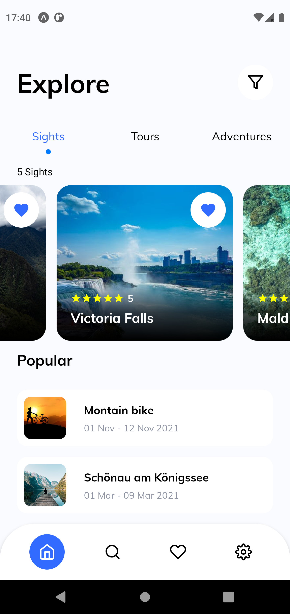
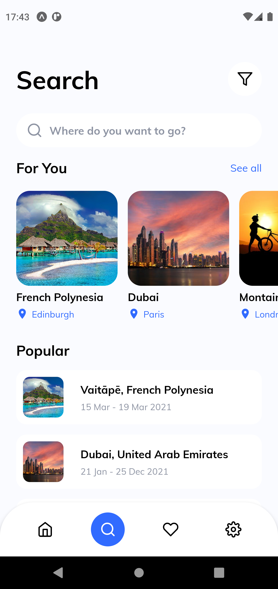
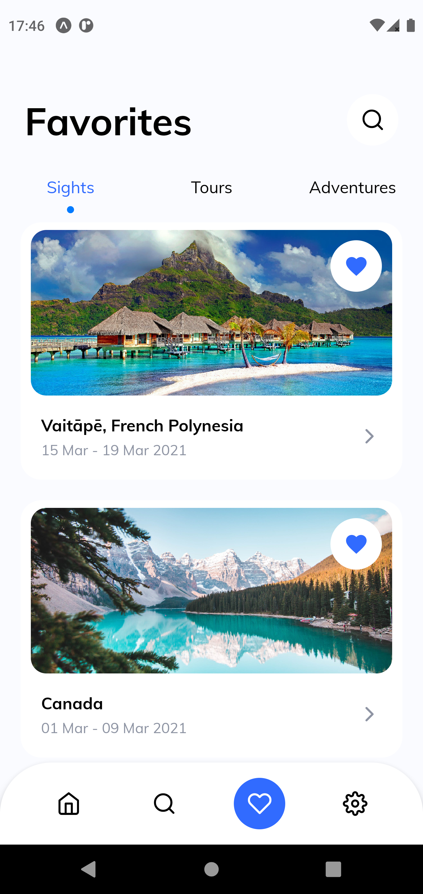
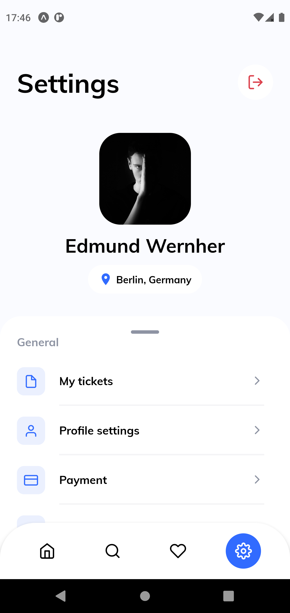

<p align="center">
  
  <br>
</p>
<h3 align="center">
O mundo na palma da mão.
</h3>

<br><br>

<p align="center">
  
  
  
  
</p>
<br>

<p align="center">
  <a href="#sobre">Sobre</a> •
  <a href="#comeON">ComeON</a> •
  <a href="#instalação">Instalação</a> •
  <a href="#tecnologias">Tecnologias</a> •
  <a href="#autor">Autor</a>  
</p>

<br><br><br>

## Sobre

Projeto desenvolvido com o intuito de colocar em prática as habilidades adquiridas durante o Ignite.
O projeto foi inspirado [nesse design](https://dribbble.com/shots/15074082-Travel-App-Onboarding-Animation) publicado no Dribbble.

## ComeON

O aplicativo comeON visa facilitar a busca de seus usuários por locais para viagens.
Esses locais estão categorizados de três formas:

### Sights:

São lugares paradisíacos com vistas incríveis. Lugares que esbanjam uma beleza natural impar.

### Tours:

São lugares famosos no mundo todo. Geralmente pontos turísticos ou locais historicamente importantes.

### Adventures:

São locais que proporcionam uma aventura a seus visitantes. Geralmente são lugares procurados por esportistas, pois propiciam a prática de esportes, em sua maioria, radicais.

<br/>

# Home

A tela Home é a porta de entrada do usuário da aplicação. Possui um botão de filtro no canto superior direito, um carrossel de lugares categorizados da maneira como foi apresentada anteriormente e no final da tela possui um componente que traz os locais mais populares da plataforma.



# Search

A tela Search é a tela onde o usuário pode buscar destinos conforme o que procura no momento. Possui filtros para serem aplicados na sua busca através do botão localizado no canto superior direito e uma barra de busca. Abaixo do campo de pesquisa, temos um carrossel contendo lugares recomendados para o usuário com base nos locais vistos anteriormente pelo mesmo. E por fim, temos novamente o componente dos locais mais populares da plataforma.



# Favorites

A tela Favorites é onde serão listados todos os lugares favoritados pelo usuário. Possui no topo da tela as tabs de categoria e no canto superior direito o botão de busca.



# Settings

A tela Settings pretende reunir todas as configurações e informações do usuário logado no aplicativo. No canto superior direito está presente o botão de logoff caso o usuário queira se deslogar do app. Pouco mais abaixo está a foto de perfil, nome e a cidade do usuário logado. Por fim, temos as opções as quais o usuário pode gerenciar atravás do menu de configurações.



## Instalação

Antes de começar, você vai precisar ter instalado em sua máquina as seguintes ferramentas:
[Git](https://git-scm.com), [Node.js](https://nodejs.org/en/).
Além disto é bom ter um editor para trabalhar com o código, como [VSCode](https://code.visualstudio.com/)

### 📱 Rodando o App

```bash
# Clone este repositório
$ git clone git@github.com:MrRioja/comeON.git

# Acesse a pasta do projeto no terminal/cmd
$ cd comeON

# Instale as dependências
$ npm install
# Caso prefira usar o Yarn execute o comando abaixo
$ yarn

# Execute a aplicação
$ expo start

# Será aberto no terminal o menu do Expo onde poderá scanear o QR Code para executar o app diretamente no seu celular ou as opções de executar no emulador android ou iOS
```

## Tecnologias


<br><br><br><br><br><br>

## Autor

<div align="center">

<h1>Luiz Rioja</h1>
<strong>Backend Developer</strong>
<br/>
<br/>

<a href="https://linkedin.com/in/luizrioja" target="_blank">

</a>

<a href="https://github.com/mrrioja" target="_blank">

</a>

<a href="mailto:lulyrioja@gmail.com?subject=Fala%20Dev" target="_blank">

</a>

<a href="https://api.whatsapp.com/send?phone=5511933572652" target="_blank">

</a>

<a href="https://join.skype.com/invite/tvBbOq03j5Uu" target="_blank">

</a>

<br/>
<br/>
</div>
